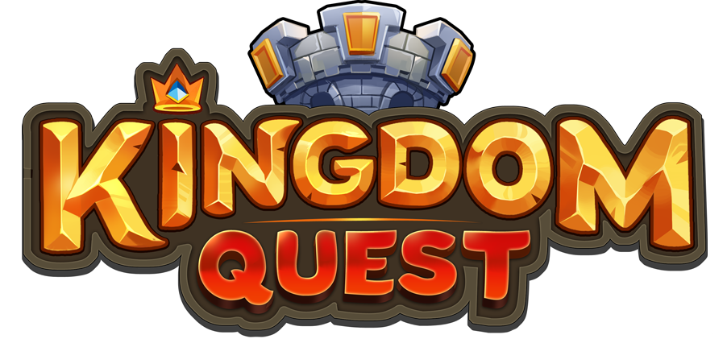

# Kingdom Quest 

## [The Game](https://aaridoms.github.io/kingdom-quest/)

# Description 

- Kingdom Quest is a game where player has to answer a series of questions correctly without failing.

# Main Functionalities 

- Player movement by clicking `left`, `right`, `up`.
- Player can `jump` and hit the answer.
- Player win if answer `5` questions correcty without failing.
- Player loses if he fails `only 1` question.

# Technologies Used 

- HTML
- CSS
- JavaScript
- DOM Manipulation
- JS Classes
- JS Audio() and images

# States 

- Start Screen
- Game Screen
- Win Screen
- Game Over Screen

# Project Structure 

## character.js 

- Character()

    - DOM Node Creation
    - this.x
    - this.y
    - this.w
    - this.h
    - gravityEffect()
    - moveUp()
    - moveLeft()
    - moveRight()
    - updatePosition()

## quest.js 

- Quest(num)

    - DOM Node Creation
    - this.x
    - this.y
    - this.w
    - this.h

## answer.js 

- Answer(num, posy, posx)

    - DOM Node Creation
    - this.num
    - this.x
    - this.y
    - this.w
    - this.h

## game.js 

- Game()

    - this.character
    - this.randomQuest
    - this.quest
    - this.correctAnswer
    - this.answerArr
    - this.answerSpawn
    - this.isGameOn
    - this.isWinCon
    - this.isCol
    - this.counter
    - this.onGameAudio
    - this.trueAudio
    - this.looseAudio
    - this.winSoundAudio
    - this.onGameAudio
    - this.onGameAudio
    - this.looseAudio
    - this.winSoundAudio.volume
    - gameOver()
    - winCondition()
    - answerSpawn(num)
    - buttonCollision()
    - regenAnswers()
    - correctAnswer()
    - floorCollision()
    - gameLoop()

## main.js 

- startGame()
- restartGame()
- winRestartGame()
- addEventListener

## data.js 

- `data.js` contains an `array` with all the data for the game to work.

# Extra Links 

|  Slides  | Deploy |
|---|---|
| [Link](#) | [Link](https://aaridoms.github.io/kingdom-quest/) |